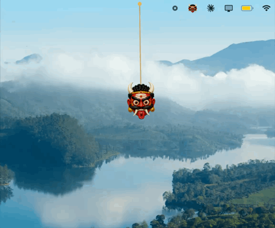

# Lucky Dangle

A little lucky charm that hangs from the top of your Mac screen. You can grab it, flick it, and it swings on a rope. Move your cursor near it and it dodges out of the way. It sits in the menu bar, stays out of your way, and you can hide it with a keyboard shortcut when you need a clean screen.

This is a personal recreation of [luckydangle.app](https://luckydangle.app) by Karthik Mahadevan. I loved the idea so I rebuilt it as a native macOS app to learn how the rope physics worked. The real thing is a paid app and it is worth the few dollars, so if you like this, go buy the original too.

## Demo



Want it in full quality? [Watch the MP4](media/demo.mp4) or [grab the original recording](media/demo.mov).

## Install (the easy way)

You do not need Xcode or any developer tools for this.

1. Download **[dist/LuckyDangle.zip](dist/LuckyDangle.zip)** (click it, then click the download button on the next page).
2. Double click the zip to unzip it. You get `LuckyDangle.app`.
3. Drag `LuckyDangle.app` into your **Applications** folder.
4. The first time you open it, macOS will complain because it did not come from the App Store. This is normal. Right click the app, choose **Open**, then click **Open** again in the box that pops up. You only have to do this once.

That is it. A small charm appears hanging from the top of your screen, and a charm icon shows up in your menu bar.

If the right click trick does not work, open Terminal and paste this, then press return:

```bash
xattr -dr com.apple.quarantine /Applications/LuckyDangle.app
```

Then open the app normally.

## How to use it

- **Grab it.** Click and drag the charm. It follows your cursor on the rope.
- **Flick it.** Give it a quick tug and let go, or just click it once. It swings and settles.
- **Hover it.** Move your cursor close without clicking and it shies away from you.
- **Menu bar icon.** Click the charm icon in the top bar to switch charms, hang your own emoji, hide or show it, or quit.
- **Hide and show.** Press **Option + Command + L** from anywhere to hide the charm before a screen share or a demo, and press it again to bring it back.

Your choice of charm is remembered, so it comes back the way you left it after a restart.

## The charms

Eight charms, each from a different tradition:

| Charm | Where it comes from |
| --- | --- |
| Nazar boncugu | Turkey and the Mediterranean |
| Hamsa | Middle East and North Africa |
| Nimbu-mirchi | India |
| Drishti bommai | South India |
| Daruma | Japan |
| Maneki-neko | Japan |
| Horseshoe | Europe and the Americas |
| Scarab | Ancient Egypt |

You can also hang any emoji you want from the menu.

## Build it yourself

If you would rather build from source, you need the Xcode Command Line Tools. If you do not have them, run `xcode-select --install` once.

```bash
git clone git@github.com:dusky01/Lucky-dangle.git
cd Lucky-dangle
./build.sh
open LuckyDangle.app
```

`build.sh` compiles the Swift source with `swiftc`, bundles the artwork, and assembles `LuckyDangle.app`. No full Xcode project needed.

## How it works

The charm hangs on a rope made of twelve points. Each frame the points fall under gravity and then get pulled back into place so the rope keeps its length. This is a Verlet rope, the same trick games use for chains and cloth. When you drag the charm, the bottom point follows your cursor. When you hover, the cursor pushes the nearby points away. A tiny bit of wind keeps it moving so it never looks frozen.

The overlay window covers the top strip of your screen but it is click through everywhere except right on the charm, so it never eats a click meant for the window underneath. A menu bar item runs the whole thing with no Dock icon.

The code is all in `src/main.swift`.

## Credits and a note on the artwork

The idea, the charm illustrations, and the original app are by Karthik Mahadevan. See [luckydangle.app](https://luckydangle.app). The charm PNG files in this repo are his artwork. They are here so the app looks right out of the box. If you are Karthik and you would like them removed, just open an issue and I will take them down.

The app code in this repo is mine and you are free to use it. Buy the real app if you enjoy this.
